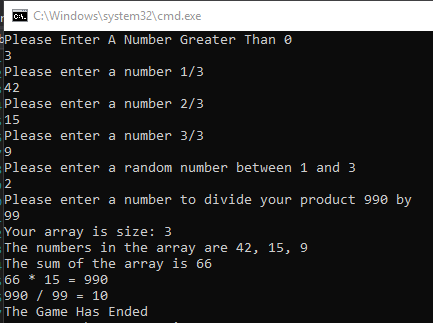

# Lab01 - Number Game

## Description

This is a console app that asks the user for a series of numbers and uses math to manipulate them and provide a result. It is full of errors that could possibly happen and handles them.

## Purpose

This lab demonstrates and executes an understanding of error handling.

## How to Run

The program can be run by opening the executable or by hitting the start within Visual Studio

## Images

